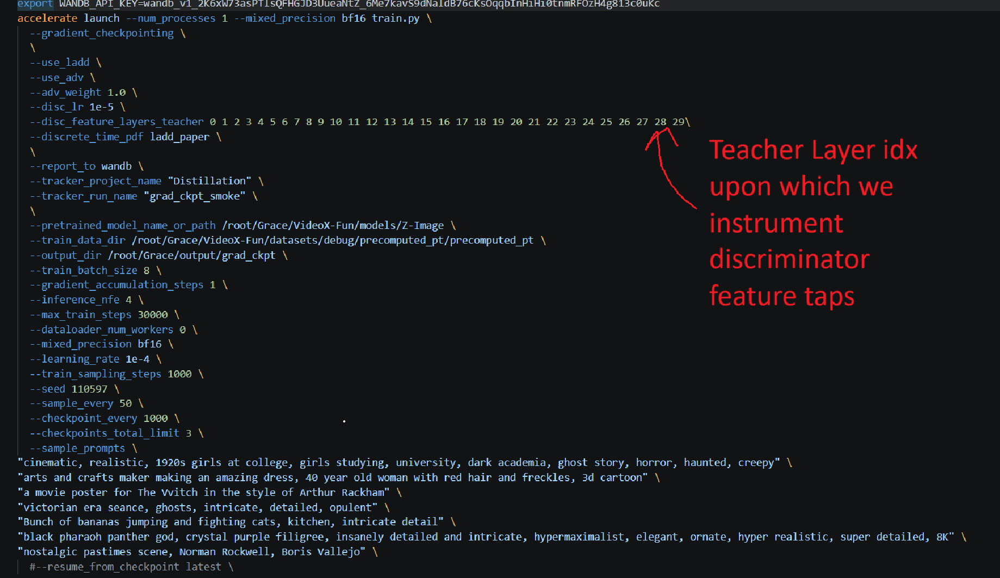
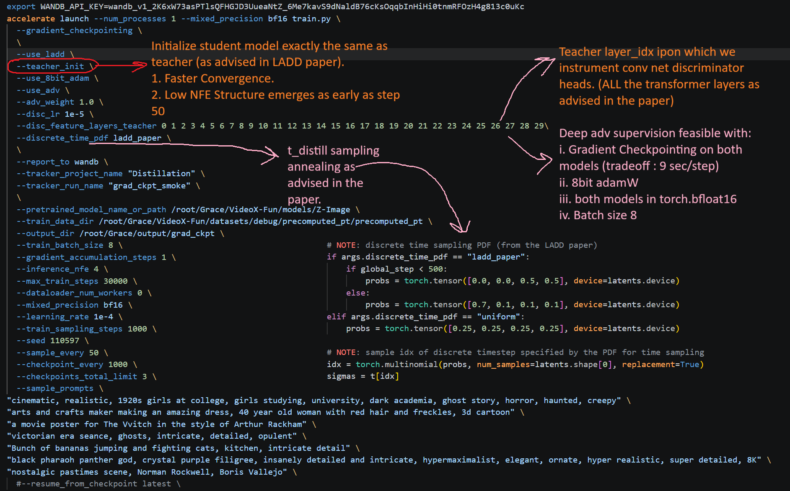
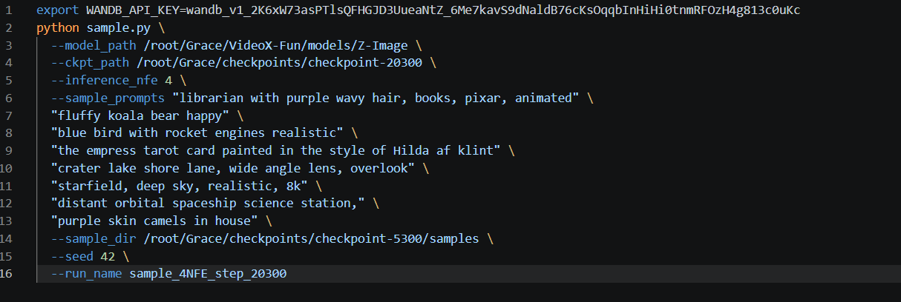
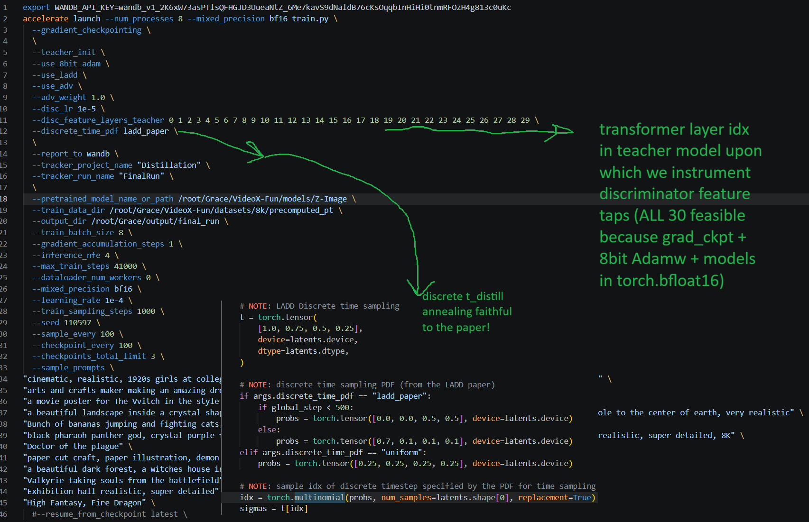
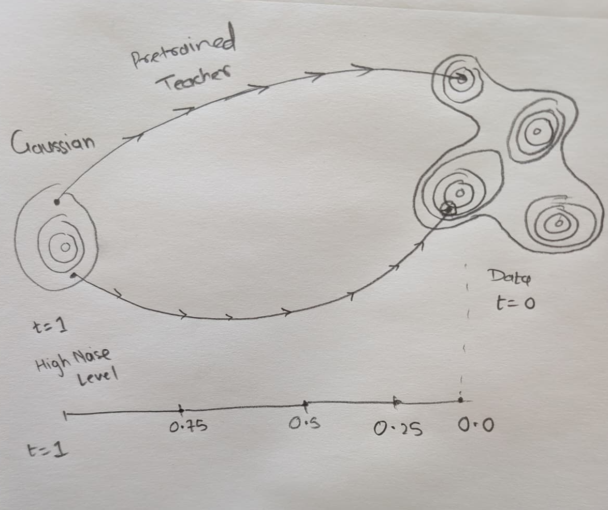
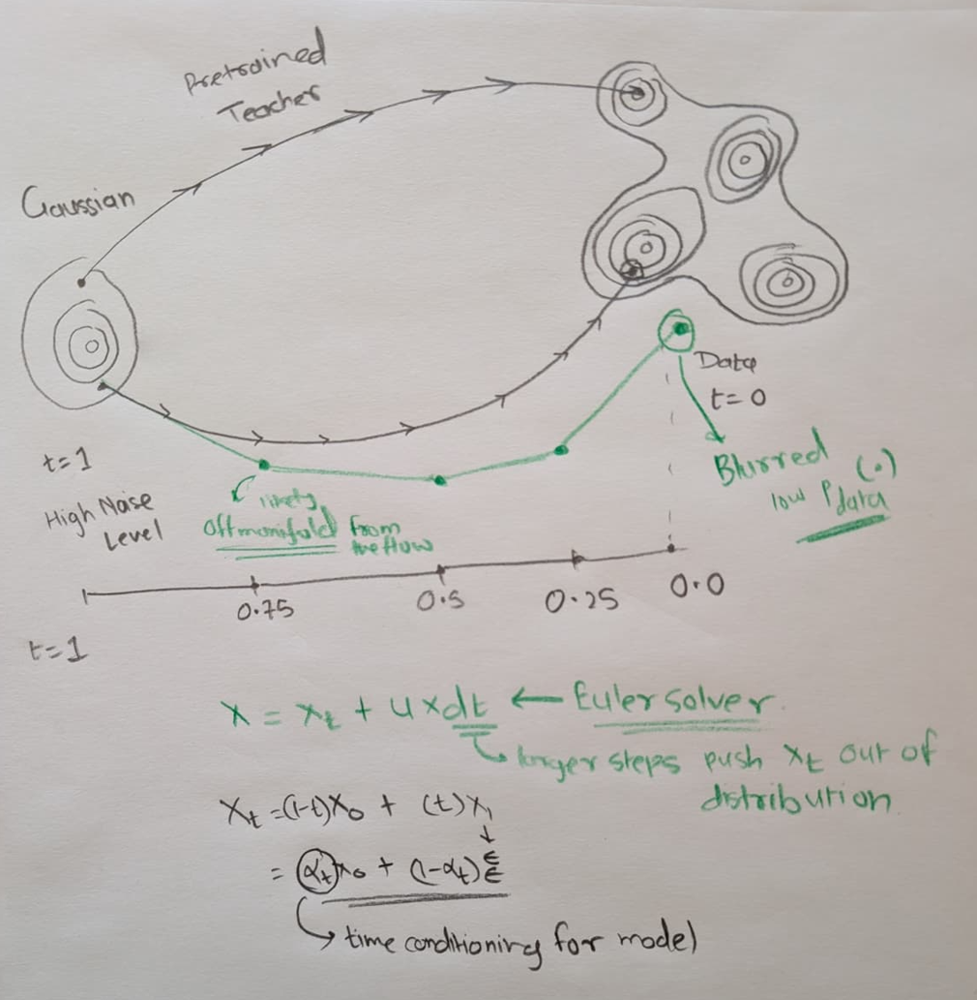
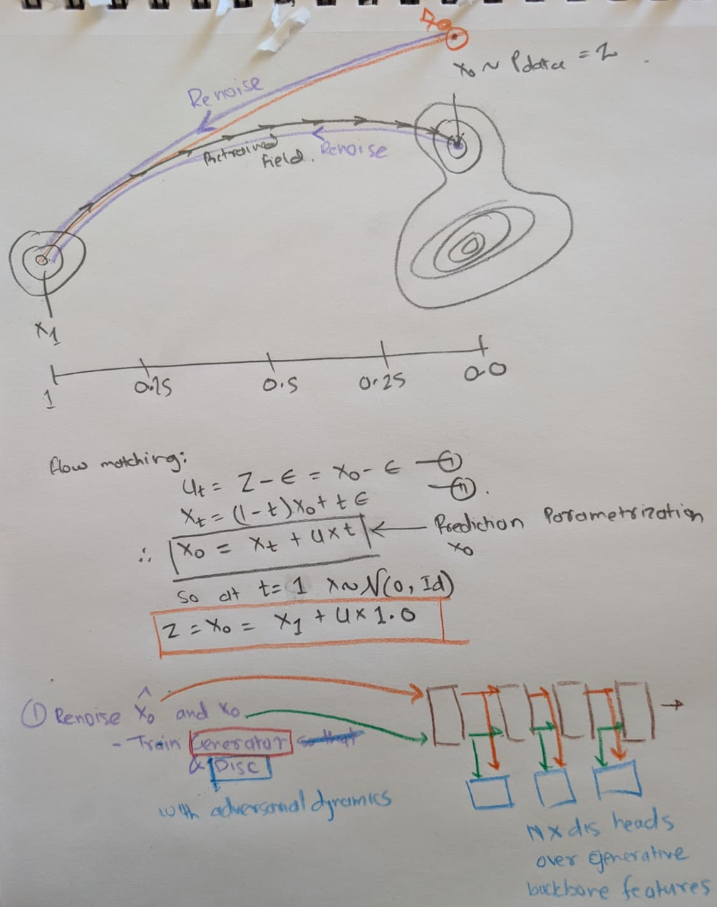
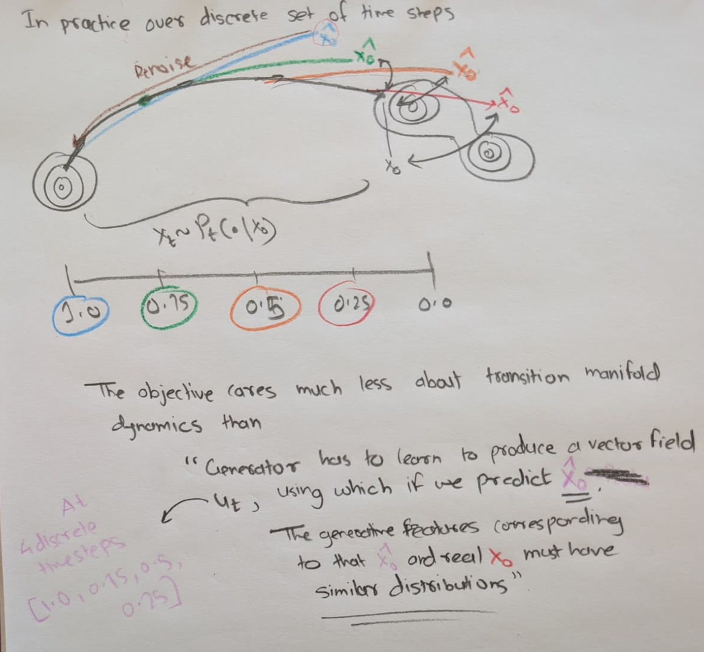
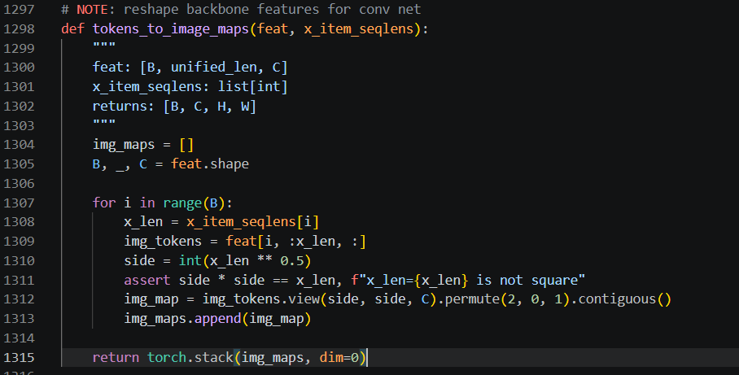
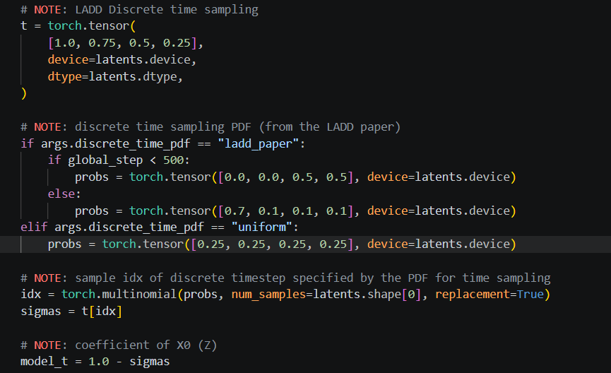

**This implementation is intentionally faithful to the LADD paper, avoiding architectural or training deviations in favor of a clean, reproducible reproduction of the original method.**

# 4 Step samples from distilled student after 20.3k training steps:

Prompts:
- *fluffy koala bear happy*
- *blue bird with rocket engines realistic*
- *the empress tarot card painted in the style of Hilda af klint*
- *crater lake shore lane, wide angle lens, overlook*
- *starfield, deep sky, realistic, 8k*
- *distant orbital spaceship science station*
- *purple skin camels in house*

---
# Important observation:
See [Why I did not use a reduced-depth student that is smaller than teacher to save memory and decided to stay faithful to LADD paper at the cost of slower steps with gradient checkpointing](#notes-on-reduced-depth-student-reducing-depth-of-the-student-to-save-memory)

# Important (Key deliverables):
- Please follow the [setup instructions](#setup) closely to reproduce workspace layout and results. Distilled student checkpoints and precomputed latent embeddings hosted on Huggingface for faster iteration, network volumes being slow.

- WANDB dashboard for the final run: https://wandb.ai/red-blue-violet/Distillation

- The training logs are available at : https://wandb.ai/red-blue-violet/Distillation/runs/4waiy8vi/logs

- Since the network volume was slower, model checkpoints for testing inference are available on huggingface: https://huggingface.co/Jchavan010/LaddFinal/tree/main/checkpoints

- Same with precomputed image latents and text embeddings : https://huggingface.co/datasets/Jchavan010/data

-   Relevant Scripts are here (once you clone the repository as instructed) :
    - 200 samples debug split overfit run to test that forward pass is functioning, gradients are flowing properly, and that model can overfit 200 images quickly (the run will be logged on the WANDB dashboard):  /root/Grace/VideoX-Fun/scripts/z_image/smoke.sh 
    - final 8xA100 run : /root/Grace/VideoX-Fun/scripts/z_image/final_run.sh 
    - inference : /root/Grace/VideoX-Fun/scripts/z_image/sample.sh 

- Note that --use_ladd flag enables or disables distillation training, if absent the script falls back to base flow matching training.

- ```--resume_from_checkpoint latest``` resumes the training from the latest checkpoint available for that experiment.


- Qualitative comparison between inference samples from a distilled student (left 20.3k steps) and teacher (right) both evaluated at 4 step generations (4-NFE), significantly better structure and fine grained details can be observed in 4 step samples from the distilled student model as opposed to the 4 step samples from teacher model which happen to be blurry and lack detail like the student samples. Hence corroborating the fact that distillation has been successful.


- Debug split overfit run command:


- Inference CLI command:


- Final Run CLI command:



---

# Also Important:
Gradient Checkpointing + adamw 8bit + both student and teacher in torch.bfloat16 allow for discriminator feature taps across all 30 layers of the teacher backbone! (Yay!)
Which is faithful to the LADD paper, tradeoff is that Gradient checkpointing on both student and teacher cost ~9.5 sec per step.
---

# Setup:
Repro note: scripts assume the /root/Grace workspace layout used in my runs.
```bash
mkdir -p /root/Grace
git clone https://github.com/JiteshChavan/LADD /root/Grace
cd /root/Grace

# setup environment
source env_setup.sh
# download training data
cd /root/Grace
source download_8k_split.sh
# debug data
source download_debug_split.sh
# download distilled ckpt
source download_ckpt.sh
```
---
### Note that all the runs and inference samples will be logged on the same WANDB dashboard (https://wandb.ai/red-blue-violet/Distillation)

### Please make sure the virtual env is activated before starting training runs or inference:

### Start 200 samples overfit run:
*Debug script: Starts Overfit expt on 200 images, makes sure checkpointing, forward pass and backward gradient flow is working and overfits 200 debug images.*
*Logs the exp to wandb*
```bash
cd /root/Grace/VideoX-Fun/scripts/z_image
bash smoke.sh
```

### Start 8xA100 run as:
*Starts final training run across 8xA100s*
*Logs the exp to wandb*
```bash
cd /root/Grace/VideoX-Fun/scripts/z_image
bash final_run.sh
```
### Run Inference as:
*Runs 4 step inference using distilled student checkpoints uploaded on huggingface.*
*logs samples to wandb*
```bash
cd /root/Grace/VideoX-Fun/scripts/z_image
bash sample.sh
```

# 1. Modeling Intuition:

### 1. Flow Transport from gaussian to data



### 2. The issue with low NFE inference


### 3. X0 reparametrization of the Flow Field to predict X0 at any given time t


### 4. Adversarial alignment between generative features corresponding to noised(X0) and noised (x0_hat), from a pretrained backbone.

#### Where x0_hat is rendered using a flow field that is only ever trained on discrete time steps [1.0, 0.75, 0.5, 0.25]
#### Basically align X0 and X0_hat indirectly via adversarial alignment between features from a pretrained backbone, when subjected to sample X0~pt(.|x0) and X0_hat ~ pt(.|x0_hat)



### 5. Basically objective ends up some sort of KLD minimization between pt(.|x0) and pt(.|x0_hat)
upon convergence samples from both the distributions look the same, one is cheaper to evaluate.

---

# 2. Insights on engineering issues encountered and their resolutions:

1. Initializing the student model exactly the same size and weights as the pre-trained base model.
    - The base model is 6B parameters although both teacher and student (12B total) can sit on an A100 idle, 80G VRAM is insufficient to train the studen initialized from teacher even if the teacher is frozen and only student is trainable.
    - even casting the weights as torch.bf16 batch size of 1 does not allow end to end training thats faithful to the paper.
    - Notably, the bottleneck is adamW optimizer state for trainable 6B params + the generator (student model) requiring gradients through the massive 6B teacher backbone for generator loss, and 80G is not enough to hold activations from both student and teacher at the same time.
    - using 8bit adamw combined with gradient checkpointing on both student + teacher model allows for batch size of 8 (512x512 resolution, 64x64 latents, 32x32 = 1024 tokens) with a memory footprint ~78.7GB.
    - Drawback is that enabling gradient checkpointing does store forward activations for both the models and during backward passes (through both student and teacher(through discriminators)) multiple partial forward passes are required. Thereby increasing time required per step (roughly 9 sec/step)

2. Again the bottle neck is having to hold activations for both student and teacher model.
    - Another possible solution to not require gradient checkpointing on teacher, is to not tap all the 30 layers from teacher for adversarial dynamic and just tap first few layers and do early exit.
    - although that deviates from the paper, I have implemented the framework to early exit during forward pass of teacher.
    - That weakens the adversarial supervision from discriminators though.

---
## Notes on Reduced depth student (reducing depth of the student to save memory)
# Important this approach is not faithful to the LADD paper, and yields worse/suboptimal convergence empirically
3. Another solution to increase through put is:
    - cut student size down, and initialize student from teacher but in a sparse interpolated way say teacher [0, 29]-> student [0, 5]
    - Observed drawback: partial init appears to have a weaker initial representation of the flow dynamics (imperfect flow matching vectorfield).
    - Because such student doesnt know the exact flow field (since does not directly preserve the teacher’s learned representation), its learning reconstructions from adversarial dynamics
    - As observed first 2100 steps of the training is spent trying to learn colors whereas student initialized from teacher yields visibly structured samples and correct colors as early as step 50.
    - Baseline starting representation of flow field is not as good as teacher init, so harder task to learn by just adversarial dynamics.
    - init from teacher starts giving really good visuals as early as step 50 in training while sparse init smaller student struggles even with correct colors till step ~2000 and even beyond at same training setup, as evident from trying an 8 layer student, to save memory, instead of 30 layer student like the teacher model.
---

4. Z_image transformer backbone runs self attention on concat(image, text) tokens just like flux kontext .1
    - Important to keep resolution -> latent size -> img_tok_seq len in mind to tap into the features from teacher, and reshape them for conv nets backbone for disc loss.
    - hardcoded to 512x512 right now but in future can be modified to slice the tensor appropriately depending on the resolution and aspect ratio.
    - conv nets for discriminator generalize well to different resolutions

5. Decided to keep discriminator heads in torch.fp32 as they are simpler and smaller and size and might lack capacity
    - the optimizer for discriminators is default AdamW as well instead of 8bit version as the overhead is not significant and I hypothesize that it should stabilize the training better than using 8bit adam for disc heads.
    - the paper requires discriminator heads to be conditioned on text + time embedding, I used simple additive modulation with mlp(pooled text and time embedding).

6. Offline precomputation of Latents before starting training runs helps with the VRAM disaster.

---
# 3. Notes on training and adversarial supervison:
- *Discriminators* : Simple conv net discriminator heads across all 30 transformer layers of the pre-trained teacher model, as advised in the LADD paper.
- *Inputs to the discriminator heads* : 
    - Z-image backbone runs unified attention over concatenated image-text embeddings.
    - The forward pass of ```ZImageTransformer2DModel``` is modified to capture concatenated activations after every transformer block (Refer forward in ```VideoX-Fun/videox-fun/models/z_image_transformer2d.py```)
    - The activations $(B, \text{img-len}+\text{cap-len}, 3840)$ tensors are first sliced to extract only the vision part of the stream then reshaped to be processed by the conv net discriminators to yield logits.
        - 
- Adversarial loss:
    - Generator loss: $\text{Binary Cross Entropy} (\text{concatenated logits}~(X^{`}_{0})~\forall~\text{30 discriminator heads}, ones)$
        - Incentivize teacher activations corresponding to $X^{`}_{0}$ prediction from generator to look as if they are similar to those corresponding to synthetic $X_{0} \sim p_{\text{data}}$
        - Fool the discriminator.
    - Discriminator loss:
        - $d_{\text{loss}} = loss_{\text{real}} + loss_{\text{real}}$
            - $loss_{\text{real}} = \text{Binary Cross Entropy} (\text{concatenated logits}~(X_{0})\quad\forall\quad\text{30 discriminator heads}, ones)$
            - $loss_{\text{fake}} = \text{Binary Cross Entropy} (\text{concatenated logits}(X_{0})\quad\forall\quad\text{30 discriminator heads}, zeros)$
            - Discriminator is incentivized to separate logits for reals and fakes.
- Reconstruction Loss (distill_loss):
    - Regresses $x^{`}_{0}$ from student against $x_{0} \sim p_{\text{data}}$
- Total Generator Loss = recon_loss + Generator Loss
- Time step sampling:
    - Discrete time steps $\in [1.0, 0.75, 0.5, 0.25]$ are sampled according to the annealing schedule defined in the paper.
        - 
    - Discriminators are also conditioned on the discrete time steps using simple additive modulation from ```nn.Sequential(nn.Linear(1, t_hidden_dim), nn.Silu(), nn.Linear(t_hiiden_dim, hidden_channels))``` (refer CondFeatureDiscHead class in VideoX-Fun/scrips/z_image/train.py)
- Training alternates between updating Generator and then Discriminator at each step. On wandb dashboard one step corresponds to one generator and one discriminator update.
--- 
# 4. Data Pipeline

The paper emphasizes using sythetic data for adversarial alignment between vectorfields u and u_hat at x_t sampled from conditional distributions $p(.| X0)$ and $p(.|X0_hat)$.

Since $X0  \sim  p_{data}(.)$ generated by the teacher backbone yields better adversarial supervision across generative features throughout different layers, when subjected to renoised X0.

To support LADD distillation, I constructed a dataset that matches the Z-Image training format using synthetic teacher-generated data.

1. Data Source
    - Sampled a subset of prompts from JourneyDB dataset: https://huggingface.co/datasets/JourneyDB/JourneyDB/blob/main/data/train/train_anno.jsonl.tgz
    - Generated corresponding images using the teacher Z-image model (40 NFE)
    - Total dataset size: ~8k image-text pairs
    - The script /root/Grace/generate.py generates images using the teacher model for training.
    - The script /root/Grace/VideoX-Fun/datasets/8k/precompute.sh which is an entry point into precompute.py precomputes VAE latents for the images and text embeddings from Qwen3ForCausalLM.

This follows the LADD setup where supervision is derived from teacher-generated samples rather than raw data.

2. Latent Precomputation

    - To make training efficient and match the Z-Image pipeline:

    The Generated Images (512×512) are encoded using the SDXL VAE
    (stored as 64×64 latent tensors)
    Text captions are encoded using Qwen3ForCausalLM
    (stored as embeddings (dim = 2560, prompts can have variable sequence length unlike OpenCLIP embeddings))

All data is stored as precomputed shards on disk to avoid repeated encoding during training.

3. Dataset Structure

Each training sample contains:

- latent image tensor (x₀)
- corresponding text embedding

4. Debug vs Full Dataset
    - Debug split (200 samples)
    - - Used for fast iteration, overfitting tests, and verifying training stability
    - Full 8k dataset
    - - Used for multi-GPU training
    
5. Rationale

Using teacher-generated data ensures consistency between teacher and student distributions during distillation
Latent precomputation significantly reduces training cost and simplifies the training loop
Debug split enables rapid validation before scaling to full runs
